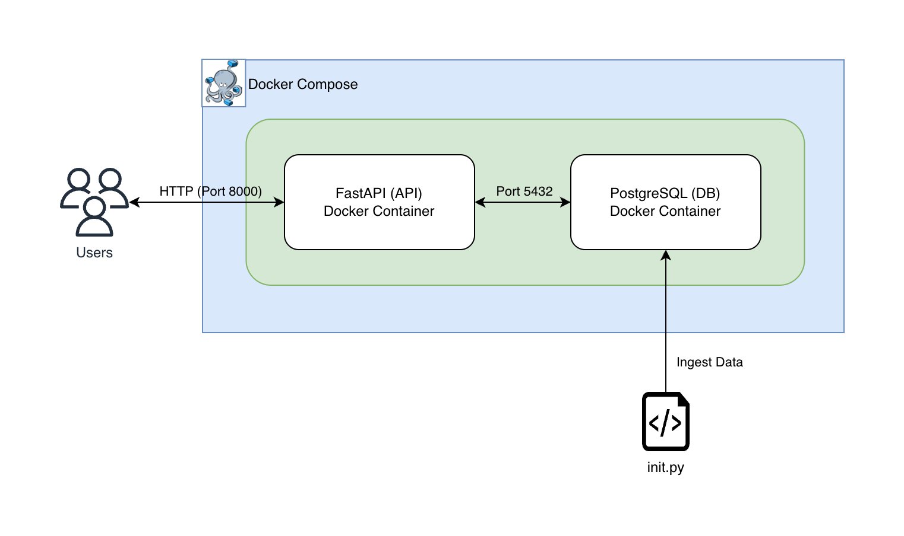
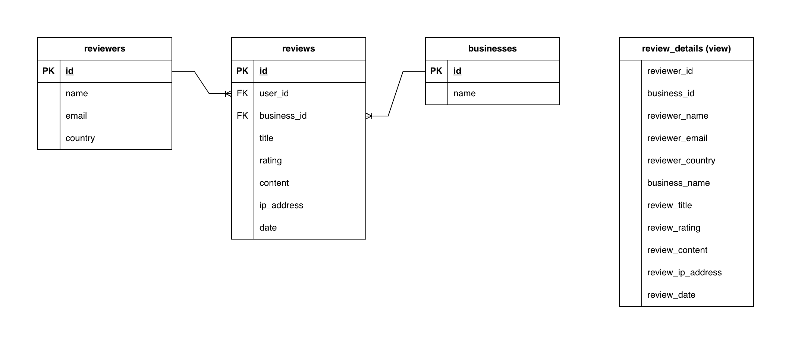

# Database API

## Introduction

This repository contains a simple PoC of an API to execute ad-hoc data requests against a database of user reviews. The following sections will explain how to run the PoC locally, its architecture, and how to use the API itself.

## Prerequisites

- [Docker](https://docs.docker.com/engine/install/)
- [Docker Compose](https://docs.docker.com/compose/install) (Included in Docker Desktop)
- Python 3.12 or higher

## Getting Started

### 1. Deploy Database and API

Use Docker Compose to deploy all the necessary infrastructure to run the PoC. In the root directory run:

```bash
docker-compose up -d
```

This will create the following application:



Will also initialize the database with tables and schemas


### 2. Initialize and Populate Database Schema and Tables

To test our API we need to load the data from the `tp_reviews.xlsx` into the database

```bash
# Create a new virtual environment
python -m venv .venv
# Activate it
source .venv/bin/activate
# Install (developement) requirements
pip install -r requirements.txt
# Execute the init script
python src/init/init.py
```

Script to convert denormalized table into three separate tables. Star schema with private and foreign keys: Facts and dimensions



## Usage

Examples:

Provide reviews for business X

```


```

Provide reviews by user Y

Provide user account information for user Z

# Developing

Contributions are welcome! Please follow these step to make sure you set up your local development correctly and adhere to the conventions followed in the project:

initialize pre-commit hooks

venv

## FAQ

Q: Why use Docker Compose and not something more scalable like Kubernetes (k8s, k3s)?

A: This way it is easier to reproduce locally for anyone who wants to try it out, however, since everything is dockerized already, the `docker-compose.yaml` could easily be converted into k8s manifest files.

Q: Why use Docker instead of cloud services?

A: This could totally be built using cloud services e.g. on AWS with API Gateway, Lambda functions and a SQL Database such as Aurora Postgres or a NoSQL Database, such as DynamoDB. However, this makes it hard to reproduce and hard to migrate. Docker containers are cloud agnostic, also, I'm a cheapskate and don't want to pay for it.

Q: Why use Postgres as database?

A: Great question! The API does not require long running analytical queries but fast transactional ones, so an OLTP database works best in this case. Of all OLTP databases I have the most experience with Postgres, so I picked that.

Q: Why use FastAPI to design the API?

A: I love Python. FastAPI can with next to no changes be used for production scenarios (unlike e.g. Flask). It comes with automatic API documentation and can easily be unit tested with it's integrated testing framework.

Q: Did you use ChatGPT to build this?

A: Absolutely. I use LLMs in my daily work from ideation phase to code autocomplete (while constantly staying alert 👀). I use it for sparring and ask it how I could improve aspects of my code. In this case I actually went with my gut feeling regarding the overall architecture as I didn't like what the AI suggested (Flask/Django + SQLite). Individual scripts I normally initially draft using LLMs and then correct and adapt to my personal liking. In some cases I learn new things by retracing what the AI did (e.g. the Postgres docker image runs init SQL scripts when placed in the correct path, wow!).